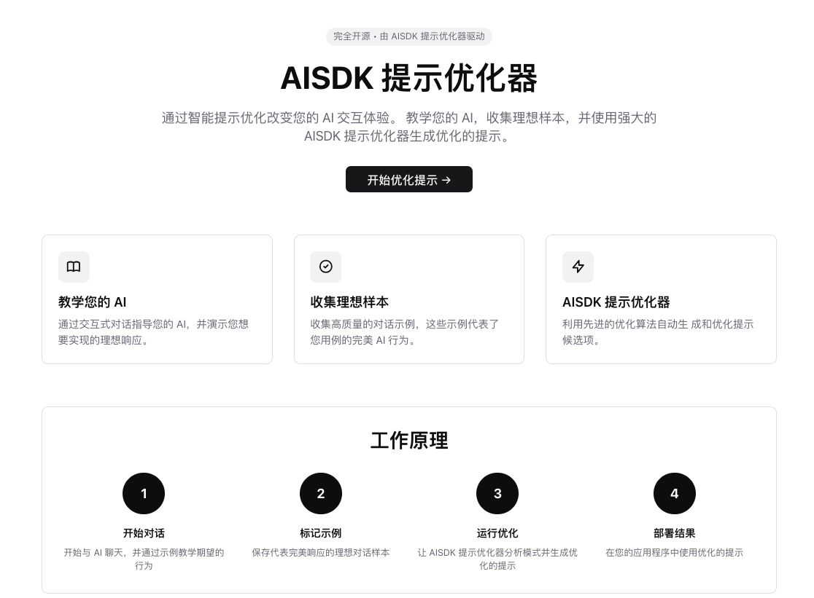
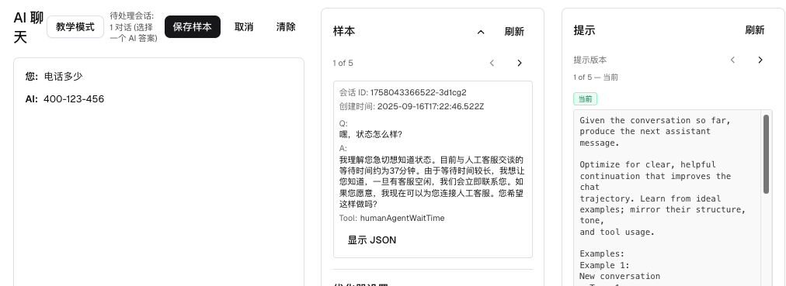

# AISDK 提示优化器

[](https://opensource.org/licenses/Apache-2.0)
[](https://opensource.org/)

通过智能提示优化改变您的 AI 交互体验。教学您的 AI，收集理想样本，并使用强大的 AISDK 提示优化器生成优化的提示。

**完全开源** - 由创建 [Langtrace AI](https://langtrace.ai) 和 [Zest](https://heyzest.ai) 的团队构建

## 什么是 GEPA？

**GEPA** (Genetic-Pareto) 是一种反射优化器，可自适应地进化 AI 系统的文本组件（如提示）。与传统优化方法只使用标量分数不同，GEPA 利用丰富的文本反馈来指导优化过程，使其能够在很少的展开中提出高性能的提示。

GEPA 的主要特性：
- **反射提示变异**：使用 LLM 反思执行轨迹并提出新指令
- **丰富的文本反馈**：利用标量奖励之外的任何文本反馈
- **基于帕累托的选择**：维护在不同场景中表现出色的候选项前沿

了解更多：[GEPA 文档](https://dspy.ai/api/optimizers/GEPA/)

## 工作原理

1. **开始对话**：开始与 AI 聊天，并通过示例教学期望的行为
2. **标记示例**：保存代表完美响应的理想对话样本
3. **运行优化**：让 AISDK 提示优化器分析模式并生成优化的提示
4. **部署结果**：在您的应用程序中使用优化的提示

## 功能特性

- **教学您的 AI**：通过交互式对话指导您的 AI，并演示您想要实现的理想响应
- **收集理想样本**：收集高质量的对话示例，这些示例代表了您用例的完美 AI 行为
- **AISDK 提示优化器**：利用先进的优化算法自动生成和优化提示候选项

## 应用界面

以下是 AISDK 提示优化器的界面截图：





## 快速开始

### 前提条件
- Node.js (推荐 18+)
- Python 的 `uv` 包管理器
- OpenAI API 密钥 或 其他 AI Provider API 密钥
- AI Gateway API 密钥

### 环境设置

在运行应用程序之前，您需要设置环境变量：

1. 复制示例环境文件：
   ```bash
   cp .env.example .env
   ```

2. 编辑 `.env` 文件并添加您的 API 密钥：
   ```bash

   
   # 使用AI Provider
   # AI_PROVIDER_API_KEY=your_actual_ai_provider_api_key_here
   
   # 可选：指定 AI Provider 基础 URL（默认为 https://api.openai.com/v1）
   # AI_PROVIDER_BASE_URL=https://api.openai.com/v1
   
   # 可选：指定 AI Provider 模型名称（默认为 gpt-4o-mini）
   # AI_PROVIDER_MODEL_NAME=gpt-4o-mini
   
   # 必需：AI Gateway API 密钥用于提示优化
   AI_GATEWAY_API_KEY=your_actual_ai_gateway_api_key_here
   ```

**重要**：切勿将您的实际 API 密钥提交到版本控制中。`.env` 文件已包含在 `.gitignore` 中。

### 安装与设置

```bash
# 克隆仓库
git clone https://github.com/Scale3-Labs/aisdk-prompt-optimizer
cd aisdk-prompt-optimizer

# 安装依赖
npm install

# 启动所有服务（推荐）
npm run dev:all
```

### 替代方案：分别启动服务

```bash
# 终端 1: 启动 Python 优化器
cd python_optimizer
uv run app.py

# 终端 2: 启动 Web 应用
npm run dev
```

Web 应用将在 `http://localhost:3000` 可用，Python 优化器在 `http://localhost:8000`。两个服务都需要运行才能使优化功能正常工作。

## 可用脚本

- `npm run dev` - 启动 Next.js 开发服务器
- `npm run dev:py` - 启动 Python 优化器服务器
- `npm run dev:all` - 同时启动所有服务

## 架构

### Python 优化器 (dspy.GEPA)

仓库包含一个轻量级 Flask 服务器，暴露 `dspy.GEPA` 优化器，由 `uv` 管理。Next.js `/api/optimize` 路由调用此服务器并将优化工件写入：
- `data/prompt.md` - 生成的优化提示
- `data/complete-optimization.json` - 完整的优化结果和元数据

### Web 应用程序

使用 Next.js 和 shadcn/ui 组件构建，Web 界面提供：
- 用于教学 AI 的交互式聊天界面
- 样本收集和管理
- 优化触发和结果可视化
- 现代、响应式的 UI，支持深色/浅色模式

## 技术栈

- **前端**：Next.js、TypeScript、Tailwind CSS、shadcn/ui
- **后端**：带有 dspy.GEPA 优化器的 Python Flask
- **包管理**：npm（前端）、uv（Python）

## 了解更多

- [DSPy 文档](https://dspy.ai/)
- [GEPA 优化器 API](https://dspy.ai/api/optimizers/GEPA/)
- [Next.js 文档](https://nextjs.org/docs)

## 部署

部署 Next.js 应用的最简单方法是使用来自 Next.js 创作者的 [Vercel 平台](https://vercel.com/new?utm_medium=default-template&filter=next.js&utm_source=create-next-app&utm_campaign=create-next-app-readme)。

对于 Python 优化器，您需要将其部署到兼容 Python 的托管服务，并相应地更新 API 端点。

查看 [Next.js 部署文档](https://nextjs.org/docs/app/building-your-application/deploying)了解更多详情。

## 许可证

本项目采用 Apache License 2.0 许可证 - 详情请见 [LICENSE](LICENSE) 文件。

## 贡献

欢迎贡献！这是一个完全开源的项目。请随时提交问题和拉取请求。

## 关于

由创建 [Langtrace AI](https://langtrace.ai) 和 [Zest](https://heyzest.ai) 的团队 ❤️ 构建。